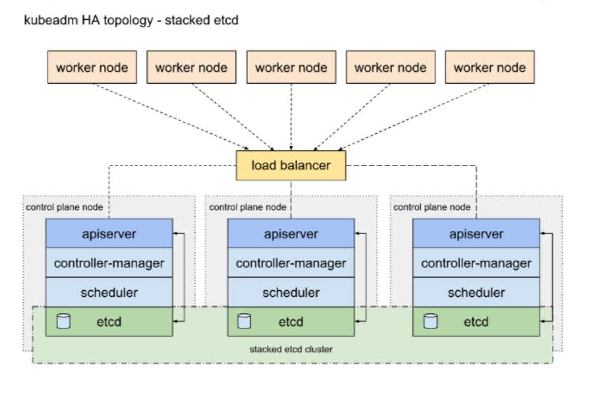

# azure-kubernetes-high-availability

Based on [Azure Self-managed Kubernetes High Availability for Open5gs](https://indoslab.medium.com/3-steps-creating-self-managed-kubernetes-high-availability-in-azure-for-open5gs-part-1-8fb43180f921)

* Self-managed Kubernetes High Availability in Azure
* This guide is not for people looking for a fully automated command to bring up a Kubernetes cluster
* Azure VM use because sctp needed for open5gs, AKS nodes do not support sctp, it was failed in AKS, if later Azure support sctp in AKS nodes, probably better to use AKS.
* Calico, Containerd, Kubernetes v1.22.x, ROOK, CEPH, HELM, Istio, Rancher, nginx
* The results of this tutorial should not be viewed as production ready, and may receive limited support from the community, but don’t let that stop you from learning!

## Topology

source : kubernetes.io

## Azure Ideal Topology

Because we don’t have 6 VMs for this simulation and only have 5 VMs, we use 1 of controller as worker, below is the topology, we should be able achieve 3 etcd and 3 rook ceph hosts as cluster to have quorum since we want to have HA, and the procedure should be similar :).

## Azure Topology Use As Alternative

## Labs

This tutorial assumes you have access to the [Azure](https://azure.microsoft.com/). While Azure is used for basic infrastructure requirements the lessons learned in this tutorial can be applied to other platforms.

* [Prerequisites](docs/01-prerequisites.md)
* [Part 1 - Azure login and Networking](docs/02-part-01.md)
* [Part 2 - Provisioning Compute Resources](docs/03-part-02.md)
* [Part 3 - Install Kubernetes](docs/04-part-03.md)
* [Part 4 - The Kubernetes Frontend Load Balancer](docs/05-part-04.md)
* [Part 5 - Bootstrapping the Kubernetes Control Plane](docs/06-part-05.md)
* [Part 6 - Bootstrapping the Kubernetes Worker Nodes](docs/07-part-06.md)
* [Part 7 - Istio, helm and Rancher](docs/08-part-07.md)
* [Part 8 - Rook Ceph](docs/09-part-08.md)
* [Part 9 - Getting access to Rancher](docs/10-part-09.md)
* [Part 10 - Getting access to Grafana](docs/11-part-10.md)
* [Part 11 - Getting access to Istio Kiali Dashboard](docs/12-part-11.md)
* [Part 12 - Testing create PVC & POD](docs/13-part-12.md)

References:

https://github.com/ivanfioravanti/kubernetes-the-hard-way-on-azure

https://assyafii.com/docs/install-kubernetes-cluster-multi-master-ha/

https://assyafii.com/docs/deploy-storage-cluster-rook-with-ceph-in-kubernetes/

https://rook.io/docs/rook/v1.7/
